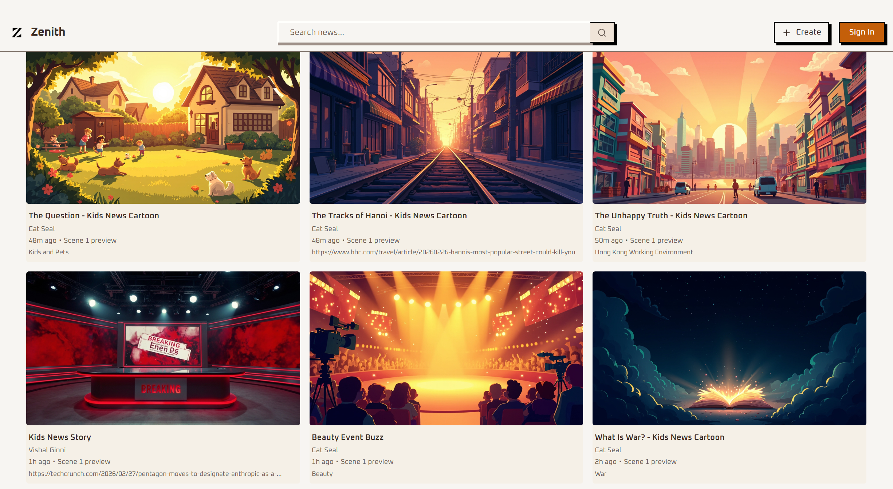

# Zenith

**Turn real-world news into kid-friendly cartoon stories in minutes.**

[](https://zenithhk.vercel.app/)

Zenith is a hackathon project built for **HackTheEast 2026** that converts a complex topic or news URL into a short, multi-scene cartoon video. By transforming adult news and complex topics into engaging, age-appropriate animated content, Zenith provides a safe and educational digital environment for children.

## 🏆 Hackathon Tracks

Zenith is designed with the following HackTheEast 2026 tracks in mind:

- **Ingram Micro & AWS Agentic AI Champion**: Zenith utilizes **AWS Bedrock (Amazon Nova Pro)** to power its core agentic text generation capabilities. It intelligently structures raw news into engaging story scripts, character profiles, and detailed scene prompts, bringing the agentic workflow to life.
- **MiniMax Creative Usage Award**: Zenith heavily utilizes the MiniMax API suite (Video, Image, and TTS) to power a highly creative, multimodal AI experience. It orchestrates multiple MiniMax tools to generate characters, scene images, and ultimately links them together into a cohesive video story.
- **ExpressVPN Digital Guardian Award**: Zenith focuses on children's digital well-being by transforming the overwhelming and often inappropriate internet news landscape into safe, educational, and easy-to-understand cartoon stories. It's a privacy-first approach to content consumption for kids.
- **OAX Foundation AI EdTech Platform Award**: Zenith tackles content overload in fast-moving fields by intelligently curating real-world news and complex topics, transforming them into easily digestible, engaging animated stories that accelerate learning.
- **RevisionDojo Future of Learning Award**: Zenith transforms education by personalizing complex, dry subjects into engaging, multimodal stories, making it significantly easier for younger or struggling learners to grasp difficult real-world concepts through adaptive, impactful content.

## 🚀 How It Works (The Workflow)

When a user enters a URL of a news page or pastes a topic, Zenith executes the following automated pipeline:

1. **Ingestion**: We scrape the content of the provided URL using **Exa** (or if a topic is provided, we search for and retrieve relevant articles).
2. **Story Planning**: We consolidate the gathered information using **AWS Bedrock (Amazon Nova Pro)** to create a kid-friendly story plan. This includes defining scenes, writing a script, creating characters, and determining the music style.
3. **Prompt Generation**: We use **AWS Bedrock** to generate a set of detailed image generation prompts for the starting and ending frames of each scene.
4. **Video Generation**: We generate videos using **MiniMax Video Generation**, utilizing the starting and ending frames to smoothly link the scenes together.
5. **Character Dialogue**: We use **MiniMax Text-to-Speech (TTS)** to generate character dialogue based on the script.
6. **Playback**: The user can play the full, sequential story directly in the app.

## ✨ Features

- Authenticated users can create workflow tasks from the header dialog.
- URL/topic ingestion with Exa (`getContents` + `searchAndContents`) and paywall fallback search.
- Structured task pipeline persisted in Convex with stage/status tracking.
- Story planning and prompt-pack generation using AWS Bedrock text generation.
- Prompt-pack generation with JSON repair fallback.
- Scene image generation from start/end frame prompts using MiniMax.
- Scene video generation with first/last-frame chaining and polling using MiniMax.
- Task detail page with:
  - Source, story plan, prompt pack, image/video asset sections
  - Stage-aware next action button
  - "Play Full Story" sequential playback experience

## 🛠️ Tech Stack

- **Frontend**: Next.js (App Router) + TypeScript, Tailwind CSS, shadcn/ui
- **Backend & Database**: Convex + Convex Auth
- **AI Text Generation**: AWS Bedrock (Amazon Nova Pro API)
- **AI Media Generation**: MiniMax (Image, Video, Speech APIs)
- **Search & Scraping**: Exa API
- **Package Manager**: Bun

## 📂 Key Files

- `convex/schema.ts` - workflow task schema and status model
- `convex/workflowTasks.ts` - workflow API re-export barrel
- `convex/workflowTasks.actions.ts` - orchestration actions
- `convex/workflowTasks.mutations.ts` - task state persistence mutations
- `convex/workflowTasks.queries.ts` - task queries
- `convex/workflow/helpers.ts` - normalization/parsing helpers
- `convex/workflow/validators.ts` - Convex validators
- `components/workflow/CreateTaskDialog.tsx` - quick task launcher
- `app/api/bedrock/route.ts` - AWS Bedrock API route
- `app/(protected)/tasks/[taskId]/page.tsx` - task details + full story playback

## 🚦 Getting Started

### Prerequisites

- [Bun](https://bun.sh/)
- Convex account/deployment
- AWS Account with Bedrock access
- Exa API key
- MiniMax API key

### Setup

```bash
bun install
bunx convex dev
bun run dev
```

### Environment Variables

Create `.env.local`:

```env
CONVEX_DEPLOYMENT=your-deployment
NEXT_PUBLIC_CONVEX_URL=https://your-deployment.convex.cloud

EXA_API_KEY=your-exa-api-key

# AWS Bedrock
AWS_ACCESS_KEY_ID=your-aws-access-key
AWS_SECRET_ACCESS_KEY=your-aws-secret-key
AWS_REGION=us-east-1

# MiniMax
MINIMAX_API_KEY=your-minimax-api-key
MINIMAX_GROUP_ID=your-group-id
```

## 🚧 In Progress / Next Steps

- Background music generation + timeline mixing
- Final composed export (single merged output file)
- Optional style presets per task

## 📄 License

MIT
